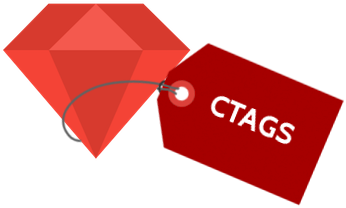

# VSCODE Ruby-Ctags
## This is the [Visual Studio Code](https://code.visualstudio.com/) extension to use [CTAGS](http://ctags.sourceforge.net/) with Ruby language through of [Ripper-Tags](https://github.com/tmm1/ripper-tags) 


## Prerequisites:
* OS : Windows / Linux (Test OK) / OSX
* [Ripper-Tags](https://github.com/tmm1/ripper-tags)

## Howto:
* Install ripper-tags "`gem install ripper-tags`" and open the user settings (File > Preferences > User Settings) and set the executable path of ripper-tags and the options to be used like the example below:
```
"ctags": {
    "executePath": "/home/username/.rbenv/shims/ripper-tags",
    "options": "--tag-file=.tags --recursive --force --exclude=/assets/ --exclude=.bundle --exclude=.git/ --exclude=coverage/ --exclude=.arcanist-extensions/ --exclude=log/ --exclude=tmp/ --exclude=bin/",
    "fileName": ".tags"
}
```
* Open a source code directory using 'Open Folder'
* Generate the ctag file for ruby using 'CTAGS:Generate' command. (Press 'F1' key and type 'CTAGS:Generate' or the keybinding `ctrl+alt+g`)
* After the ctag file is generated, search the symbol by select it on editor and use 'CTAGS:Search' command. (Press 'F1' key and type 'CTAGS:Search' or the keybinding `ctrl+alt+t`);

## Keybindings
### 1. Generate ctags
Press `ctrl+alt+g` (`cmd+alt+g` on mac)  
//  

### 2. Search ctags
Select the words in the vscode and press `ctrl+alt+t` (`cmd+alt+t` on mac)  
//  

## Etc
* Source : [otoniel-isidoro/vscode-ruby-ctags](https://github.com/otoniel-isidoro/vscode-ruby-ctags)

## Release Note
* 2016.08.21 1.0.0 : First release

### This is a fork of [hcyang1012/vscode_ctags](https://github.com/hcyang1012/vscode_ctags) that was adapted to work better with ruby language.
#### Thanks to hcyang1012!
** Enjoy! **
